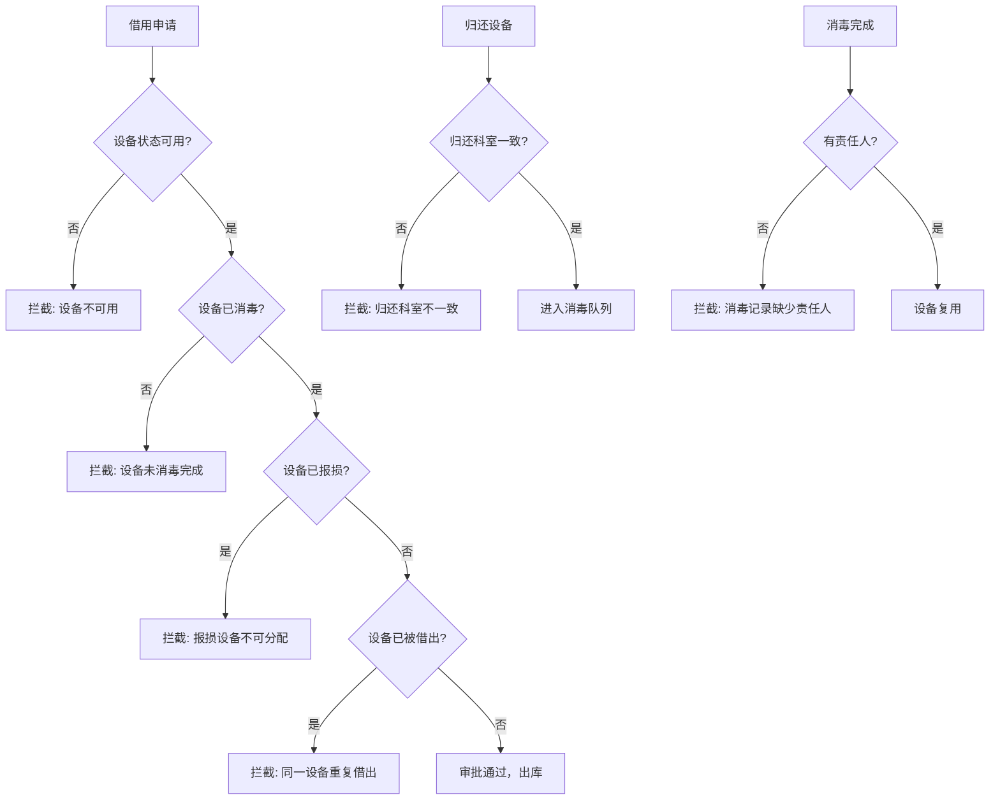

## 1. 产品概述

医疗器械借用、消毒与报损追踪系统——面向医院科室与设备库房管理场景，实现器械从借用申请到归还消毒再到报损报废的全生命周期闭环管理，通过强制校验规则杜绝未消毒复用、报损器械分配等高风险操作，保障医疗安全。

- 目标用户：医院设备科库管人员、临床科室借用人员、消毒供应中心工作人员
- 核心价值：杜绝器械流转中的安全隐患，实现全程可追溯、状态可管控

## 2. 核心功能

### 2.1 用户角色

| 角色 | 注册方式 | 核心权限 |
|------|----------|----------|
| 科室人员 | 系统分配 | 申请借用设备、查看借用记录、归还设备 |
| 库管人员 | 系统分配 | 审批借用申请、确认出库/入库、管理设备台账、导出报损数据 |
| 消毒人员 | 系统分配 | 执行消毒流程、填写消毒记录、标记消毒完成 |

### 2.2 功能模块

1. **器械台账页面**：设备全量列表，维护序列号、风险等级、消毒要求、当前位置、可用状态，支持新增/编辑/搜索/筛选
2. **借用看板页面**：可视化借用申请流程，支持申请→审批→出库→归还的完整流转，看板式展示各状态借用单
3. **消毒队列页面**：展示待消毒和消毒中的设备队列，消毒人员执行消毒操作并填写记录，完成后设备恢复可用
4. **报损导出页面**：报损申请与审批流程，报损后设备标记为不可用，支持导出含借用人、消毒批次、报损原因和当前状态的报损清单

### 2.3 页面详情

| 页面名称 | 模块名称 | 功能描述 |
|----------|----------|----------|
| 器械台账 | 设备列表 | 全量设备表格，展示序列号、名称、风险等级、消毒要求、当前位置、状态标签；支持按风险等级/状态/科室筛选 |
| 器械台账 | 设备新增/编辑 | 表单录入设备信息：名称、序列号（唯一）、风险等级（高/中/低）、消毒要求（描述）、归属科室 |
| 借用看板 | 借用申请 | 科室人员选择可用设备、填写借用原因、预计归还时间提交申请 |
| 借用看板 | 审批出库 | 库管审批申请通过后确认出库，设备状态变为"借出" |
| 借用看板 | 归还操作 | 科室人员归还设备，校验归还科室一致性，设备进入待消毒队列 |
| 消毒队列 | 待消毒列表 | 按归还时间排序展示待消毒设备，高风险器械置顶 |
| 消毒队列 | 消毒执行 | 消毒人员填写消毒方法、批次号、责任人，完成后设备复用 |
| 消毒队列 | 消毒记录 | 历史消毒记录查看，含设备、批次、责任人、消毒时间 |
| 报损导出 | 报损申请 | 选择设备填写报损原因提交，系统校验设备当前状态 |
| 报损导出 | 报损审批 | 库管审批报损，通过后设备状态永久标记为"报损" |
| 报损导出 | 数据导出 | 导出报损清单（含借用人、消毒批次、报损原因、当前状态），支持历史导出记录查看 |

## 3. 核心流程

### 3.1 器械借用全流程

科室人员发起借用申请 → 库管审批通过 → 库管确认出库 → 科室使用 → 科室归还设备 → 系统校验归还科室 → 设备进入待消毒队列 → 消毒人员执行消毒 → 填写消毒记录（含责任人） → 消毒完成设备复用

### 3.2 报损流程

发现设备损坏 → 提交报损申请（含原因） → 库管审批 → 报损生效，设备标记不可用 → 报损记录可导出

### 3.3 拦截规则流程

## 4. 用户界面设计

### 4.1 设计风格

- **主色调**：医疗蓝（#0F4C81）搭配警示橙（#E8600A），传达专业感与风险警示
- **辅色调**：浅灰背景（#F5F6FA）、白色卡片、状态色（绿/黄/红）
- **按钮风格**：圆角8px，主按钮实色填充，危险操作红色警示
- **字体**：中文使用思源黑体风格，数字/英文使用等宽字体，表格数据密集使用13px
- **布局风格**：左侧固定导航栏 + 右侧内容区，卡片化布局，看板使用泳道式
- **图标风格**：Lucide 线性图标，24px，与文字对齐

### 4.2 页面设计概览

| 页面名称 | 模块名称 | UI 元素 |
|----------|----------|---------|
| 器械台账 | 设备列表 | 表格布局，顶部搜索+筛选栏，行内状态徽章（绿=可用/黄=借出/红=报损/蓝=消毒中），分页 |
| 器械台账 | 设备新增/编辑 | 侧滑抽屉表单，必填项标记，风险等级下拉，序列号唯一性实时校验 |
| 借用看板 | 看板视图 | 四列泳道（待审批/已审批/借出中/已归还），卡片拖拽感，逾期卡片橙色边框+脉冲动画 |
| 借用看板 | 申请表单 | 模态框，设备选择器（仅显示可用设备），日期选择，科室选择 |
| 消毒队列 | 队列列表 | 双列布局（待消毒/消毒中），高风险器械红色标签+置顶，进度条显示消毒流程 |
| 消毒队列 | 消毒表单 | 模态框，必填责任人和批次号，消毒方法选择 |
| 报损导出 | 报损列表 | 表格布局，报损状态徽章，操作列含审批和导出按钮 |
| 报损导出 | 导出面板 | 导出按钮+日期范围筛选，导出历史列表，CSV格式下载 |

### 4.3 响应式设计

- 桌面优先设计，最小适配1280px宽度
- 表格在小屏下支持横向滚动
- 看板在窄屏下切换为列表视图

### 4.4 关键交互提示

- 逾期未归还：借用卡片显示逾期天数，页面顶部显示逾期提醒横幅
- 高风险器械：列表中红色标签标识，借用时二次确认弹窗
- 拦截操作：操作被拦截时显示红色Toast提示，说明拦截原因
- 报损设备：行背景淡红，操作按钮灰化不可点击
