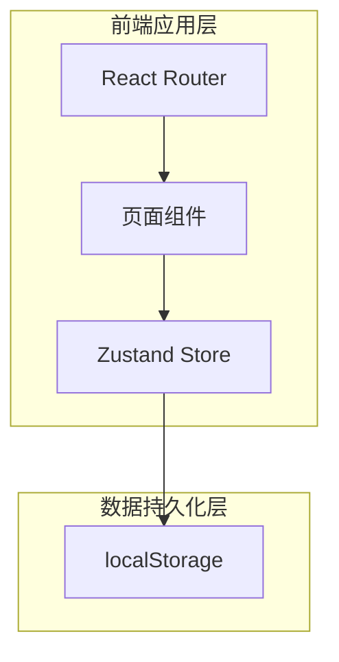
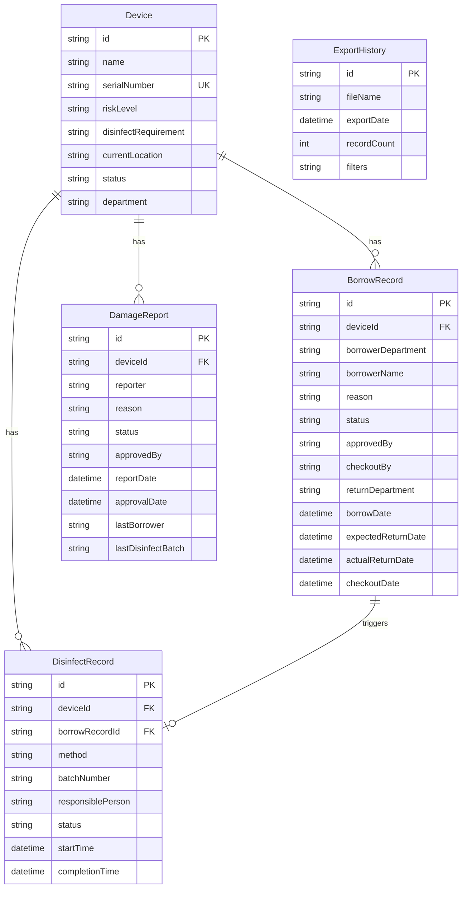

## 1. 架构设计

纯前端单页应用架构，使用 Zustand 管理全局状态并通过 localStorage 持久化，确保重启后数据一致性。

## 2. 技术说明

- **前端框架**：React 18 + TypeScript
- **样式方案**：Tailwind CSS 3
- **构建工具**：Vite 6
- **状态管理**：Zustand 5（含 persist 中间件实现 localStorage 持久化）
- **路由方案**：React Router DOM 7
- **图标库**：Lucide React
- **后端服务**：无（纯前端，数据持久化至 localStorage）
- **数据库**：无（localStorage 模拟持久化）

## 3. 路由定义

| 路由 | 用途 |
|------|------|
| / | 器械台账页面，设备全量管理 |
| /borrow | 借用看板页面，借用申请与流转 |
| /disinfect | 消毒队列页面，消毒流程管理 |
| /damage | 报损导出页面，报损审批与数据导出 |

## 4. API 定义

无后端 API，所有数据操作通过 Zustand Store 完成。

Store 提供以下核心方法：
- `addDevice` / `updateDevice`：设备增删改
- `createBorrowRequest`：创建借用申请
- `approveBorrow`：审批借用
- `checkoutBorrow`：确认出库
- `returnBorrow`：归还设备
- `startDisinfect`：开始消毒
- `completeDisinfect`：完成消毒
- `createDamageReport`：创建报损申请
- `approveDamage`：审批报损
- `exportDamageReport`：导出报损数据

## 5. 数据模型

### 5.1 数据模型定义

### 5.2 数据定义

**设备状态枚举（DeviceStatus）**：
- `available`：可用
- `borrowed`：借出
- `disinfecting`：消毒中
- `pending_disinfect`：待消毒
- `damaged`：已报损

**风险等级枚举（RiskLevel）**：
- `high`：高风险
- `medium`：中风险
- `low`：低风险

**借用记录状态枚举（BorrowStatus）**：
- `pending`：待审批
- `approved`：已审批
- `checked_out`：已出库
- `returned`：已归还

**消毒记录状态枚举（DisinfectStatus）**：
- `pending`：待消毒
- `in_progress`：消毒中
- `completed`：已完成

**报损单状态枚举（DamageStatus）**：
- `pending`：待审批
- `approved`：已批准

### 5.3 业务校验规则

| 规则编号 | 触发场景 | 校验逻辑 | 拦截行为 |
|----------|----------|----------|----------|
| V1 | 借用申请 | 设备状态必须为 available | 提示"设备不可用" |
| V2 | 借用申请 | 设备必须已完成消毒（无待消毒记录） | 提示"设备未消毒完成" |
| V3 | 借用申请 | 设备无报损记录或报损未通过 | 提示"报损设备不可分配" |
| V4 | 借用申请 | 设备未被其他借用单占用 | 提示"同一设备重复借出" |
| V5 | 归还操作 | 归还科室与借出科室一致 | 提示"归还科室不一致" |
| V6 | 消毒完成 | 消毒记录必须填写责任人 | 提示"消毒记录缺少责任人" |
| V7 | 高风险器械借用 | 高风险器械必须经过消毒才能借出 | 强制消毒校验 |
| V8 | 逾期检查 | 借出超过预计归还日期 | 页面显示逾期提醒 |

### 5.4 持久化策略

使用 Zustand persist 中间件，将以下数据持久化到 localStorage：
- `devices`：设备列表及状态
- `borrowRecords`：借用记录
- `disinfectRecords`：消毒记录
- `damageReports`：报损单
- `exportHistories`：导出历史

所有数据使用 JSON 序列化，key 前缀为 `med-track-`，确保重启后数据一致性。
